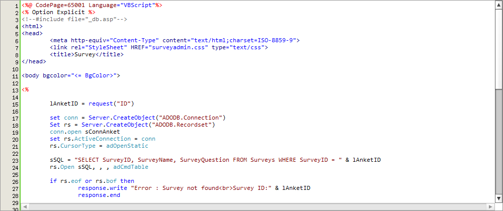

# CodeHighlightEditor

修改 开源项目 CodeHighlightEditor http://code.google.com/p/code-syntax-highlight-editor

> demo

>  调整内容

- 给onload事件添加参数 objectId, textareaId
- 添加onchange事件，处理由编辑器写回 textarea

> 项目

[dungang/yii2-code-editor](https://github.com/dungang/yii2-code-editor)